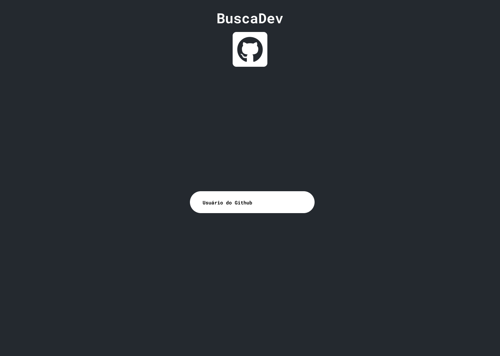

# BuscaDev 


<h4 align="center">
    Projeto de consumo da API do Github para buscar através dos seus nomes de usuários
</h4>

## :art: Layout


## :hammer_and_wrench: Techs 

#### [ReactJS](https://reactjs.org/)
#### [React Icons](https://react-icons.github.io/react-icons/) 


## Metodologies
[x] CSS Modules

## :desktop_computer: How to use
##### 

Rode no Terminal
```
    yarn dev
```